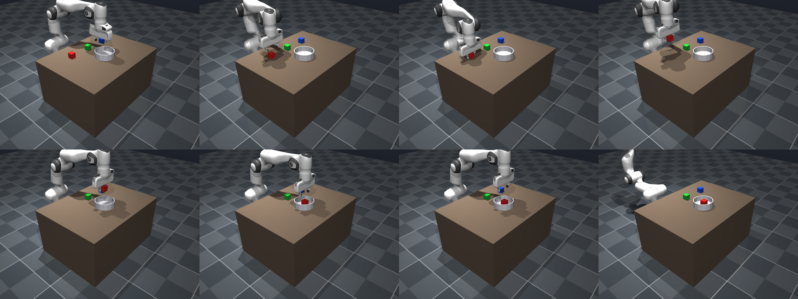
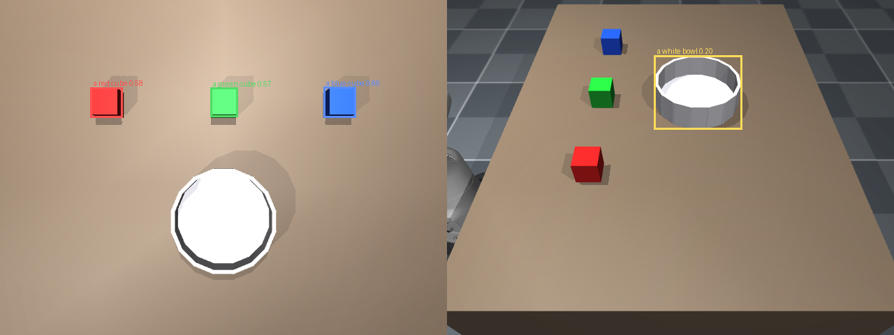

# VoiceArm — engineering notes

Why things are built the way they are, and what broke on the way there.
The [README](README.md) has the overview; this is the detail behind it.

## Results

**M1 — arm actuation** (`out/m1_frames.png`)

| Pose | Commanded → reached (max joint error) | Gripper displacement |
|---|---|---|
| home | 0.0066 rad | — |
| swing_left | 0.0066 rad | 0.380 m |
| lift_up | 0.0043 rad | 0.459 m |

**M2 — inverse kinematics**, 10 random reachable targets, damped least squares:

| Metric | Value |
|---|---|
| Targets within 5 mm | **10 / 10** |
| Mean position error | **0.44 mm** |
| Max position error | 1.79 mm |
| Mean solve time | **0.1 ms** |

**M3 — pick and place**, each block grasped from its ground-truth pose and
dropped in the container:



| Metric | Value |
|---|---|
| Blocks placed in the container | **3 / 3** |
| Lift height on grasp | 0.146 m (all three) |
| Mean final offset from container centre | **1.7 mm** |
| Grasp strategy | friction only — no weld constraint needed |

**M4 — open-vocabulary grounding**, four free-text queries against simulator
ground truth:



| Query | Camera | Score | Error |
|---|---|---|---|
| "a red cube" | topcam | 0.58 | 0.5 cm |
| "a green cube" | topcam | 0.56 | 0.2 cm |
| "a blue cube" | topcam | 0.65 | 0.5 cm |
| "a white bowl" | perceptcam | 0.21 | 1.5 cm |

**4 / 4 within 3 cm**, mean error **0.66 cm**.

**M5 — local LLM planner**, `Qwen3-4B-4bit` via MLX, no cloud API:

| Language | Utterances | Executed |
|---|---|---|
| English | 2 | 2 |
| Tanglish (romanized) | 3 | 3 |
| Tamil script | 3 | 3 |
| **Total** | **8** | **8** |

Median plan latency **0.87 s** on the shipped 4B (first call is slower, cold
cache). Every one of the eight was planned by the LLM; the regex fallback was
not needed. These eight utterances are the fixed set the planner comparison in
[Model selection](#model-selection) also scores against.

**ASR benchmark** (`./run.sh bench`), 6 Tamil sentences synthesised with the
macOS `Vani` voice and read from wav files, so room acoustics are out of the
loop. Character error rate against the reference text:

| backend | mean CER | median CER |
|---|---|---|
| whisper-large-v3 (multilingual) | 16.7% | **0.0%** |
| whisper-tamil-medium (specialist) | **4.8%** | **0.0%** |
| routed — what ships | **4.8%** | **0.0%** |

The mean and the median tell different stories, and the median is the honest
one: the multilingual model is exact on 5 of 6 sentences and then decodes the
sixth into Devanagari at 100% CER. Its problem is not steady inaccuracy, it is
rare total failure. The specialist never failed that way; its non-zero scores
are sandhi spellings (`நீலக்` for `நீல`), which are orthographic conventions
rather than recognition errors. The router picked the specialist 6/6.

These are synthetic voices. Synthetic speech is markedly easier than human
speech, so treat these as a floor on error, not an estimate of real accuracy.

**M6 — dual-ASR router.** Tamil audio, both backends transcribed correctly and
the router picked the specialist:

| Model | Transcript |
|---|---|
| whisper-large-v3 (MLX) | சிவப்பு கட்டையை கிண்ணத்தில் வை. |
| whisper-tamil-medium | சிவப்பு கட்டையை கிண்ணத்தில் வை ← chosen |

Detected language `ta`, Tamil script ratio 1.00. The cleanup pass turned that
into *"Put the red cube in the bowl."*, which planned and executed successfully.

> The M6 clip is macOS `say -v Vani` synthesis, not a human recording, and the
> script says so at runtime. Real-speaker accuracy — especially on Tanglish — is
> untested and should be assumed worse.

**M7 — aggregate over the 9 logged episodes** (8 typed + 1 spoken):

| Metric | Value |
|---|---|
| Success rate | **9 / 9** |
| Mean detection error | **0.37 cm** (max 0.50 cm) |
| Mean episode duration | 5.6 s |
| Median LLM latency | 1.86 s |
| Warm ASR latency | 13–20 s |

Reproduce with `./run.sh m1` … `./run.sh m5`, `./run.sh app`.

## Design notes

**Silence was hallucinated into a task.** The first real microphone test recorded
nothing -- the machine's input volume was at 27 out of 100 -- and Whisper
correctly returned an empty transcript. The planner then invented a fluent
instruction from that empty string, the arm executed it, and the run printed
PASS. Nothing failed; it succeeded at the wrong thing, which is the worst kind of
bug because it looks like the good kind. `route()` now raises `NoSpeechDetected`
on digital silence or an empty transcript, and `execute()` refuses an empty
utterance. The level gate catches only true silence: quiet speech still
transcribes, and Whisper judges intelligibility far better than an amplitude
threshold does -- an early 0.01 rms cutoff rejected speech that was perfectly
audible.

**Whisper's language ID is unstable on short Tamil clips.** Over repeated runs of
the same audio it reported `ta` most of the time, but also `hi` and `kn`,
transcribing Tamil speech into Devanagari or Kannada script. The router
originally dispatched to the Tamil specialist on Tamil script alone, so it
skipped that model in exactly the cases that needed it most. Any Indic language
guess now triggers it, and the specialist wins whenever it returns Tamil script
-- measured at 4.8% character error rate against 16.7%.

**Grasping needed 6-DoF IK, not position-only.** The Panda's fingers slide along
the hand frame's *y* axis, so a top-down grasp has to constrain orientation as
well as position. `ik()` stacks the positional and rotational site Jacobians and
solves both together; `GRASP_DOWN_MAT` points the site *z* axis at the table and
aligns the finger-separation axis with world *y*.

**Depth lands on the top face, not the centre.** An overhead view only ever sees
an object's top surface, so the deprojected point sits half an object-height too
high. For anything resting on the table the centre is the midpoint between that
surface and the tabletop — which needs no prior knowledge of the object's size.

**All MuJoCo rendering is funnelled through one worker thread.** A `Renderer`
owns an OpenGL context bound to its creating thread, and a web framework calls in
from a different worker thread per request. and on macOS both reusing a
context across threads *and* creating a second one from another thread deadlock
rather than raise — the dashboard hung silently on its first command. `SimEnv`
now owns a single-worker executor; every render is submitted to it and the
caller blocks on the result.

**IK is damped least squares on the site Jacobian.** `mink` is used when it is
installed; the built-in solver is the default path and is what the numbers above
were measured with. Step size is clamped and joint limits are enforced each
iteration, so the solver stays stable near singularities.

**`SimEnv.park()` exists because the arm occludes the worktop.** At the home
pose the Panda sits directly under the overhead camera. `park()` retracts it
behind the base (gripper at x ≈ −0.33 m), found with a joint sweep constrained
to no new contacts, giving perception an unoccluded view.

## Model selection

Every choice below was measured on this machine, not assumed.

**Planner: `Qwen3-4B-4bit`, not 8B.** Both models produced a correct plan on all
8 test utterances (English, Tanglish, Tamil script), so the larger model bought
nothing on this task:

| planner | plans correct | mean generation | MLX active |
|---|---|---|---|
| **Qwen3-4B-4bit** | **8/8** | **0.87 s** | **2.26 GB** |
| Qwen3-8B-4bit | 8/8 | 1.55 s | 4.61 GB |

**`sarvam-m` (24 B) was rejected on footprint.** It is the strongest open model
for Tamil, but at 4-bit it needs roughly 13 GB and cannot co-reside with the
detector and both ASR models. That is a hardware constraint, not a quality
claim — with more memory it would be worth revisiting, especially since the
planner does have to read Tanglish.

**ASR: both, with a router.** See the CER table above. The specialist wins on
Tamil and is Tamil-only, so neither model is a safe default alone.

## Performance

End-to-end stage latency with all models resident, same input repeated:

| run | ASR | plan | perceive | total |
|---|---|---|---|---|
| cold | 16.63 s | 4.33 s | 4.04 s | 25.00 s |
| warm 1 | 8.15 s | 4.87 s | 1.11 s | 14.13 s |
| warm 2 | 6.44 s | 1.73 s | 0.87 s | 9.04 s |
| warm 3 | 4.94 s | 1.42 s | 0.94 s | **7.30 s** |

MLX active memory 5.35 GB, peak 5.93 GB.

**Allocator pressure, not compute, dominated the first version.** With the 8B
planner the same loop ran 45 s and got *slower* every iteration, reaching 63 s.
The cause was not model size in isolation: MLX and torch each keep an allocator
pool that survives a forward pass, and with four models resident those pools
were enough to start paging. Calling `mx.clear_cache()` once took a single plan
call from 37.5 s to 1.7 s — a 22x swing with no change to the model.

`src/memory.py` now drops both caches at stage boundaries. **Doing it inside the
hot path made things worse**: clearing after every `transcribe()` call forced a
full reallocation on the next operation and pushed the loop back to 60 s. The
cache is there for a reason; only the boundaries between models are worth
clearing.

**Interleaved access is the expensive pattern.** Measuring all ASR calls, then
all planner calls, then all detector calls looked fast. Running one command at a
time — ASR, then plan, then detect — is 5-10x slower, because each switch pages
the previous model out. That is the real workload, so that is what the table
above reports.

**Some of this is the machine, not the code.** `vm.swapusage` showed 20.1 GB of
21.5 GB swap already in use before this project started, spread across many
ordinary applications rather than any single large process. On a machine with
free swap these numbers would be better; they are reported as measured.

## Running on two backends

The same code runs on Apple Silicon through MLX and on Spaces through
transformers. `src/backend.py` picks at import time and resolves the model ids:

| | local (Apple Silicon) | Spaces (x86 + NVIDIA) |
|---|---|---|
| planner | `mlx-community/Qwen3-4B-4bit` | `Qwen/Qwen3-4B-Instruct-2507` |
| multilingual ASR | `mlx-community/whisper-large-v3-mlx` | `openai/whisper-large-v3-turbo` |
| Tamil ASR | `vasista22/whisper-tamil-medium` | same |
| detector | `google/owlv2-base-patch16-ensemble` | same |
| rendering | CGL (macOS default) | `MUJOCO_GL=egl` |

Everything above the model-loading layer is shared: the router, the planner
prompt, IK, grasp waypoints, 3D grounding, episode logging.

Force the portable path on a Mac to test the Spaces code without deploying:

```bash
VOICEARM_BACKEND=torch ./run.sh m5
```

Measured on this machine, same command end to end: **7.0 s** on MLX,
**27.5 s** on the transformers path over MPS. The transformers numbers are not
representative of ZeroGPU, which runs an H200.

## Why `webapp/` exists

A notebook cell could call `execute()` in three lines, so a whole Gradio app
needs justifying: **browser microphone capture.** `sounddevice` needs a local
input device and a Colab runtime has none, so the voice half of a
"voice-controlled arm" would be unreachable in the only demo a visitor can
actually run. It also sidesteps the input-volume trap that made the first local
microphone test silently record nothing — see the design notes.

The same file serves all three paths: `localhost` for development, `--share` for
a tunnelled URL, and the notebook's launch cell on Colab.
