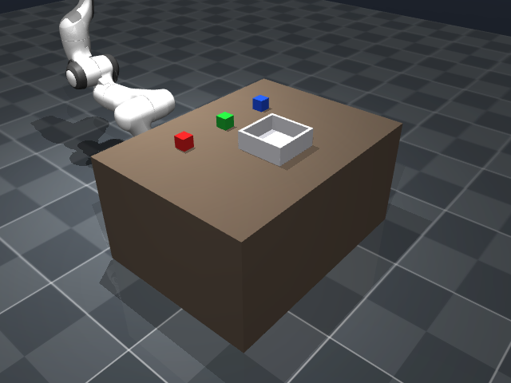
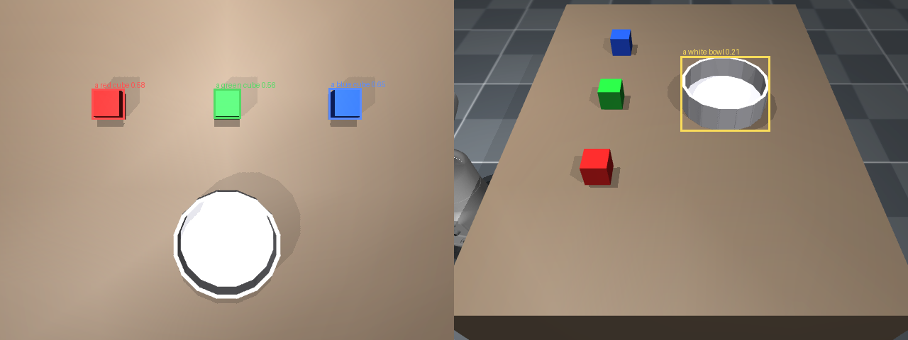

# VoiceArm

**Code-Switched Speech Grounding for Open-Vocabulary Robotic Manipulation**

A bilingual (Tamil / English / Tanglish) voice-controlled Franka Panda arm in
MuJoCo. Spoken instructions are transcribed, converted into a structured task
plan by a local language model, grounded to 3D object positions with
open-vocabulary detection, and executed through an inverse-kinematics
controller. Everything runs on-device on Apple Silicon — no cloud API.

> Simulation only. No sim-to-real transfer is claimed.



## Status

| Milestone | Scope | State |
|---|---|---|
| **M0** | Environment, dependencies, Panda assets | ✅ done |
| **M1** | Scene, arm actuation, offscreen rendering | ✅ done |
| **M2** | Forward + inverse kinematics | ✅ done |
| **M3** | Grasp primitives (pick & place) | ✅ done |
| **M4** | Open-vocabulary perception (OWLv2 + depth) | ✅ done |
| **M5** | Local LLM task planner | ✅ done |
| **M6** | Dual-ASR Tamil/English speech router | ✅ done |
| **M7** | Episode logging + Streamlit dashboard | ✅ done |

## Pipeline

```
  mic ──► Whisper large-v3 (MLX) ──┐
                                   ├─► script-based router ──► cleaned utterance
          whisper-tamil-medium ────┘
                                            │
                                            ▼
                                   Qwen3-8B-4bit planner
                                            │  JSON task plan
                                            ▼
   topcam RGB+depth ──► OWL-ViT ──► 3D grounding ──► IK ──► MuJoCo execution
                                                              │
                                                              ▼
                                                   episode log ──► Streamlit
```

## Results so far

**M1 — arm actuation** (`out/m1_frames.png`)

| Pose | Commanded → reached (max joint error) | Gripper displacement |
|---|---|---|
| home | 0.0066 rad | — |
| swing_left | 0.0066 rad | 0.380 m |
| lift_up | 0.0043 rad | 0.459 m |

**M2 — inverse kinematics**, 10 random reachable targets, damped least squares:

| Metric | Value |
|---|---|
| Targets within 5 mm | **10 / 10** |
| Mean position error | **0.44 mm** |
| Max position error | 1.79 mm |
| Mean solve time | **0.1 ms** |

**M3 — pick and place**, each block grasped from its ground-truth pose and
dropped in the container:


| Metric | Value |
|---|---|
| Blocks placed in the container | **3 / 3** |
| Lift height on grasp | 0.146 m (all three) |
| Mean final offset from container centre | **1.7 mm** |
| Grasp strategy | friction only — no weld constraint needed |

**M4 — open-vocabulary grounding**, four free-text queries against simulator
ground truth:



| Query | Camera | Score | Error |
|---|---|---|---|
| "a red cube" | topcam | 0.58 | 0.5 cm |
| "a green cube" | topcam | 0.56 | 0.2 cm |
| "a blue cube" | topcam | 0.65 | 0.5 cm |
| "a white bowl" | perceptcam | 0.21 | 1.5 cm |

**4 / 4 within 3 cm**, mean error **0.66 cm**.

**M5 — local LLM planner**, `Qwen3-8B-4bit` via MLX, no cloud API:

| Language | Utterances | Executed |
|---|---|---|
| English | 2 | 2 |
| Tanglish (romanized) | 3 | 3 |
| Tamil script | 3 | 3 |
| **Total** | **8** | **8** |

Median plan latency **1.86 s** (first call 10.4 s, cold cache). Every one of the
eight was planned by the LLM; the regex fallback was not needed.

**ASR benchmark** (`./run.sh bench`), 6 Tamil sentences synthesised with the
macOS `Vani` voice and read from wav files, so room acoustics are out of the
loop. Character error rate against the reference text:

| backend | mean CER | median CER |
|---|---|---|
| whisper-large-v3 (multilingual) | 16.7% | **0.0%** |
| whisper-tamil-medium (specialist) | **4.8%** | **0.0%** |
| routed — what ships | **4.8%** | **0.0%** |

The mean and the median tell different stories, and the median is the honest
one: the multilingual model is exact on 5 of 6 sentences and then decodes the
sixth into Devanagari at 100% CER. Its problem is not steady inaccuracy, it is
rare total failure. The specialist never failed that way; its non-zero scores
are sandhi spellings (`நீலக்` for `நீல`), which are orthographic conventions
rather than recognition errors. The router picked the specialist 6/6.

These are synthetic voices. Synthetic speech is markedly easier than human
speech, so treat these as a floor on error, not an estimate of real accuracy.

**M6 — dual-ASR router.** Tamil audio, both backends transcribed correctly and
the router picked the specialist:

| Model | Transcript |
|---|---|
| whisper-large-v3 (MLX) | சிவப்பு கட்டையை கிண்ணத்தில் வை. |
| whisper-tamil-medium | சிவப்பு கட்டையை கிண்ணத்தில் வை ← chosen |

Detected language `ta`, Tamil script ratio 1.00. The cleanup pass turned that
into *"Put the red cube in the bowl."*, which planned and executed successfully.

> The M6 clip is macOS `say -v Vani` synthesis, not a human recording, and the
> script says so at runtime. Real-speaker accuracy — especially on Tanglish — is
> untested and should be assumed worse.

**M7 — aggregate over the 9 logged episodes** (8 typed + 1 spoken):

| Metric | Value |
|---|---|
| Success rate | **9 / 9** |
| Mean detection error | **0.37 cm** (max 0.50 cm) |
| Mean episode duration | 5.6 s |
| Median LLM latency | 1.86 s |
| Warm ASR latency | 13–20 s |

Reproduce with `./run.sh m1` … `./run.sh m5`, `./run.sh app`.

## Live demo

**[huggingface.co/spaces/dheepakkaran/VoiceArm](https://huggingface.co/spaces/dheepakkaran/VoiceArm)** —
results, benchmarks, and recorded episodes, with buttons that open the live
pipeline on a free GPU:

**[Run it on Colab](https://colab.research.google.com/github/dheepakkaran/VoiceArm-Bilingual-Tamil-English-Voice-Controlled-Robotic-Arm-MuJoCo/blob/main/notebooks/voicearm_demo.ipynb)** —
one click. The notebook clones this repo, installs the portable stack, runs every
milestone script, and launches the Gradio app with a public share link.

Colab is the only runner the page links, because its default T4 is sm_75 and the
stack works on it unmodified. Kaggle's free tier defaults to a Tesla P100 (sm_60),
which the installed PyTorch does not support and which bitsandbytes 4-bit cannot
use at all — and the Kaggle API has no field for the accelerator type, so a
first-time visitor would have to know to change it in the UI. A demo button that
fails unless you already know the fix is worse than no button.

**Why the Space is static.** Hosting a Gradio Space needs an HF PRO
subscription — a free account gets `402 Payment Required` on create — and a free
GPU session's share link dies with the session. So the permanent link is a static
page and the live pipeline runs on borrowed GPU. The Gradio app is written and
tested either way:

```bash
python scripts/deploy_space.py --kind static --push USER/VoiceArm   # free
python scripts/deploy_space.py --kind gradio --push USER/VoiceArm   # needs PRO
```

`scripts/bench_planner.py` compares planner models on the eight reference
utterances. It is the way to settle whether `sarvam-m` (24B) would plan better
than the shipped Qwen3-4B -- that model was rejected purely because 13 GB at
4-bit will not co-reside with two ASR models and a detector on 16 GB. It wants a
24 GB GPU, which this project has not had access to, so the README's claim stays
what it is: a footprint decision, not a measured one.

## Running on two backends

The same code runs on Apple Silicon through MLX and on Spaces through
transformers. `src/backend.py` picks at import time and resolves the model ids:

| | local (Apple Silicon) | Spaces (x86 + NVIDIA) |
|---|---|---|
| planner | `mlx-community/Qwen3-4B-4bit` | `Qwen/Qwen3-4B-Instruct-2507` |
| multilingual ASR | `mlx-community/whisper-large-v3-mlx` | `openai/whisper-large-v3-turbo` |
| Tamil ASR | `vasista22/whisper-tamil-medium` | same |
| detector | `google/owlv2-base-patch16-ensemble` | same |
| rendering | CGL (macOS default) | `MUJOCO_GL=egl` |

Everything above the model-loading layer is shared: the router, the planner
prompt, IK, grasp waypoints, 3D grounding, episode logging.

Force the portable path on a Mac to test the Spaces code without deploying:

```bash
VOICEARM_BACKEND=torch ./run.sh m5
```

Measured on this machine, same command end to end: **7.0 s** on MLX,
**27.5 s** on the transformers path over MPS. The transformers numbers are not
representative of ZeroGPU, which runs an H200.

## Setup

```bash
git clone <this repo> && cd VoiceArm-Bilingual-Tamil-English-Voice-Controlled-Robotic-Arm-MuJoCo
./setup.sh
```

`setup.sh` creates `.venv`, installs dependencies, and downloads only the
`franka_emika_panda` directory from `mujoco_menagerie` (36 MB) rather than
cloning the full repository.

## Running

```bash
./run.sh m1      # three-pose actuation demo, writes out/m1_frames.png
./run.sh m2      # IK accuracy table over 10 random targets
./run.sh m3      # pick and place all three blocks, writes out/m3_pickplace.mp4
./run.sh m4      # open-vocabulary detection + 3D grounding vs ground truth
./run.sh m5      # eight Tamil / English / Tanglish commands, end to end
./run.sh app     # Streamlit dashboard on http://localhost:8501

.venv/bin/python scripts/m6_voice.py             # synthesised Tamil clip
.venv/bin/python scripts/m6_voice.py --mic       # speak into the microphone
.venv/bin/python scripts/m6_voice.py --wav f.wav # your own recording
./run.sh test    # pytest smoke suite
```

## Design notes

**The grasp site and wrist camera are injected with `MjSpec`.** The vendored
Panda model has no end-effector site, and MJCF `<include>` cannot add children
to a body defined inside the included file. `src/sim.py` loads the scene as a
spec, adds a `grasp_site` at the Panda TCP (0.1034 m along `+z` of the `hand`
frame) plus a wrist camera, then compiles. The vendored asset stays untouched.

**Grasping needed 6-DoF IK, not position-only.** The Panda's fingers slide along
the hand frame's *y* axis, so a top-down grasp has to constrain orientation as
well as position. `ik()` stacks the positional and rotational site Jacobians and
solves both together; `GRASP_DOWN_MAT` points the site *z* axis at the table and
aligns the finger-separation axis with world *y*.

**Transit waypoints use a looser tolerance than the grasp.** Near the edge of the
workspace the 2 mm grasp tolerance is unreachable for approach and lift poses,
which made `place()` fail on a target that was in fact fine to reach. Approach
and lift now solve to 6 mm; only the grasp waypoint holds 2 mm.

**Perception uses a camera cascade, not a per-object rule.** Straight down, a
bowl is only a white ring and OWLv2 scored nothing against any bowl-like query;
from an angle it scores 0.29. Cubes ground far more accurately from overhead
(0.2–0.5 cm vs 1.4–2.0 cm) because their top face is what the depth sample hits.
`locate()` therefore tries `topcam` first and falls back to the angled
`perceptcam`, taking the first confident detection. Nothing in that path knows
which objects need which view, so an unseen noun gets the same benefit.

**Depth lands on the top face, not the centre.** An overhead view only ever sees
an object's top surface, so the deprojected point sits half an object-height too
high. For anything resting on the table the centre is the midpoint between that
surface and the tabletop — which needs no prior knowledge of the object's size.

**The bowl is a ring of 16 boxes with quaternion rotations.** MuJoCo takes its
angle unit from the compiler, and the vendored `panda.xml` sets
`angle="radian"`; degree-valued `euler` attributes were silently reinterpreted
and produced a starburst instead of a bowl.

**The dashboard streams the motion live rather than only replaying it.**
`SimEnv.start_recording` takes an `on_frame` callback invoked as each frame is
captured, so the Streamlit script can push frames into a placeholder while the
episode is still running; the same frames are then encoded to mp4 per episode
for replay. A pick-and-place streams 176 frames over roughly 9 seconds.

**All MuJoCo rendering is funnelled through one worker thread.** A `Renderer`
owns an OpenGL context bound to its creating thread. Streamlit reruns the script
on a different ScriptRunner thread each time, and on macOS both reusing a
context across threads *and* creating a second one from another thread deadlock
rather than raise — the dashboard hung silently on its first command. `SimEnv`
now owns a single-worker executor; every render is submitted to it and the
caller blocks on the result.

**The planner prompt carries a romanized-Tamil glossary.** Qwen3 reads Tamil
script well but did not know `sivappu` means red — it planned a pick on the bowl
for *"sivappu block-ah bowl-la vai"*. Adding a short colour/verb glossary and two
Tanglish examples to the system prompt took that case from wrong to correct, and
all 8 M5 utterances now plan through the LLM.

**Transit waypoints degrade instead of aborting.** Perception put the container
5 mm further out than ground truth, which pushed the approach waypoint just past
the top-down workspace and failed the whole episode at 9.2 mm of IK error. Place
approaches are lower than lift approaches now, and a transit waypoint that
stalls within 2 cm is accepted rather than raised — precision there buys nothing.

**IK is damped least squares on the site Jacobian.** `mink` is used when it is
installed; the built-in solver is the default path and is what the numbers above
were measured with. Step size is clamped and joint limits are enforced each
iteration, so the solver stays stable near singularities.

**The overhead camera is rotated, not just raised.** `topcam` uses
`xyaxes="0 1 0 -1 0 0"` so the image's wide axis covers the table's wide axis
(world *y*). At a fixed height this fits the whole worktop in frame, which
matters for M4 detection.

**`SimEnv.park()` exists because the arm occludes the worktop.** At the home
pose the Panda sits directly under the overhead camera. `park()` retracts it
behind the base (gripper at x ≈ −0.33 m), found with a joint sweep constrained
to no new contacts, giving perception an unoccluded view.

## Layout

```
src/config.py       paths, model ids, tuning constants
src/sim.py          SimEnv — model build, actuation, rendering
src/kinematics.py   FK, damped-least-squares IK (3- and 6-DoF), interpolation
src/grasp.py        top-down pick / place primitives from Cartesian waypoints
src/perception.py   RGB-D capture, OWLv2 detection, pinhole 3D grounding
src/planner.py      local Qwen3 planner + deterministic Tamil regex fallback
src/speech.py       dual-ASR script router and transcript cleanup
src/executor.py     utterance -> plan -> perception -> motion -> episode
src/episodes.py     LeRobot-compatible parquet logging
src/video.py        mp4 encoding and contact-sheet helpers
src/backend.py      MLX-or-transformers selection and model id resolution
hf_space/           Gradio app, requirements, and apt packages for Spaces
hf_space/static/    the free static showcase page
notebooks/          Colab notebook for the full pipeline, plus the planner ablation
scripts/bench_planner.py  planner model comparison on the 8 reference utterances
app.py              Streamlit dashboard
assets/scene.xml    table, three blocks, container, overhead camera
scripts/m*.py       one runnable acceptance demo per milestone
tests/test_smoke.py smoke suite
```

## Stack

| Layer | Choice |
|---|---|
| Physics | MuJoCo 3.12 |
| Robot | Franka Emika Panda (`mujoco_menagerie`) |
| IK | Damped least squares (`mink` optional) |
| Perception | OWLv2 (`google/owlv2-base-patch16-ensemble`) |
| Planner | `mlx-community/Qwen3-8B-4bit` via `mlx-lm` |
| ASR | `mlx-community/whisper-large-v3-mlx` + `vasista22/whisper-tamil-medium` |
| Episodes | LeRobot-compatible parquet (pyarrow, not the `lerobot` package) |
| UI | Streamlit |

## Model selection

Every choice below was measured on this machine, not assumed.

**Planner: `Qwen3-4B-4bit`, not 8B.** Both models produced a correct plan on all
8 test utterances (English, Tanglish, Tamil script), so the larger model bought
nothing on this task:

| planner | plans correct | mean generation | MLX active |
|---|---|---|---|
| **Qwen3-4B-4bit** | **8/8** | **0.87 s** | **2.26 GB** |
| Qwen3-8B-4bit | 8/8 | 1.55 s | 4.61 GB |

**`sarvam-m` (24 B) was rejected on footprint.** It is the strongest open model
for Tamil, but at 4-bit it needs roughly 13 GB and cannot co-reside with the
detector and both ASR models. That is a hardware constraint, not a quality
claim — with more memory it would be worth revisiting, especially since the
planner does have to read Tanglish.

**ASR: both, with a router.** See the CER table above. The specialist wins on
Tamil and is Tamil-only, so neither model is a safe default alone.

## Performance

End-to-end stage latency with all models resident, same input repeated:

| run | ASR | plan | perceive | total |
|---|---|---|---|---|
| cold | 16.63 s | 4.33 s | 4.04 s | 25.00 s |
| warm 1 | 8.15 s | 4.87 s | 1.11 s | 14.13 s |
| warm 2 | 6.44 s | 1.73 s | 0.87 s | 9.04 s |
| warm 3 | 4.94 s | 1.42 s | 0.94 s | **7.30 s** |

MLX active memory 5.35 GB, peak 5.93 GB.

**Allocator pressure, not compute, dominated the first version.** With the 8B
planner the same loop ran 45 s and got *slower* every iteration, reaching 63 s.
The cause was not model size in isolation: MLX and torch each keep an allocator
pool that survives a forward pass, and with four models resident those pools
were enough to start paging. Calling `mx.clear_cache()` once took a single plan
call from 37.5 s to 1.7 s — a 22x swing with no change to the model.

`src/memory.py` now drops both caches at stage boundaries. **Doing it inside the
hot path made things worse**: clearing after every `transcribe()` call forced a
full reallocation on the next operation and pushed the loop back to 60 s. The
cache is there for a reason; only the boundaries between models are worth
clearing.

**Interleaved access is the expensive pattern.** Measuring all ASR calls, then
all planner calls, then all detector calls looked fast. Running one command at a
time — ASR, then plan, then detect — is 5-10x slower, because each switch pages
the previous model out. That is the real workload, so that is what the table
above reports.

**Some of this is the machine, not the code.** `vm.swapusage` showed 20.1 GB of
21.5 GB swap already in use before this project started, spread across many
ordinary applications rather than any single large process. On a machine with
free swap these numbers would be better; they are reported as measured.

## License

Panda model © Franka Emika, redistributed from `mujoco_menagerie` under Apache
2.0 (see `assets/mujoco_menagerie/franka_emika_panda/LICENSE`).
