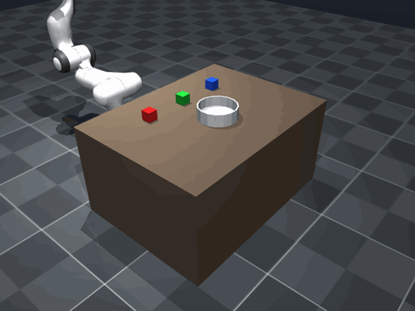

# VoiceArm

**Bilingual voice-controlled robot arm in MuJoCo.**

Say something in Tamil, English, or Tanglish and a simulated Franka Panda does
it. Speech is transcribed, turned into a task plan by a local language model,
the named object is found in the camera image, and inverse kinematics executes
the pick-and-place. Everything runs on-device -- no cloud API.

> Simulation only. No sim-to-real transfer is claimed.



*`sivappu block-ah bowl-la vai` -- spoken Tanglish, planned and executed in 4.9 s.*

## How it works

```
  mic --> whisper-large-v3 -----+
                                +--> language router --> transcript
          whisper-tamil-medium -+                            |
                                                             v
                                                Qwen3-4B planner (local)
                                                             |  JSON plan
                                                             v
  camera RGB+depth --> OWLv2 --> 3D position --> inverse kinematics
                                                             |
                                                             v
                                              MuJoCo execution --> episode log
```

The planner outputs plain text like `"a red cube"`, and that string goes
straight to the detector as a search query -- so there is no fixed list of
objects anywhere in the code.

## Try it

**On a free GPU, one click:**

[](https://colab.research.google.com/github/dheepakkaran/VoiceArm-Bilingual-Tamil-English-Voice-Controlled-Robotic-Arm-MuJoCo/blob/main/notebooks/voicearm_demo.ipynb)

The notebook clones the repo, installs everything, runs each stage, and opens the
web app with a public link. About 30-60 s per command on a T4.

**Locally:**

```bash
git clone https://github.com/dheepakkaran/VoiceArm-Bilingual-Tamil-English-Voice-Controlled-Robotic-Arm-MuJoCo.git
cd VoiceArm-Bilingual-Tamil-English-Voice-Controlled-Robotic-Arm-MuJoCo
./setup.sh
```

```bash
./run.sh app     # web app on localhost:7860
./run.sh m3      # watch it pick and place
./run.sh test    # 29 tests
```

`setup.sh` builds a virtualenv and downloads only the Franka Panda from
`mujoco_menagerie` (36 MB) instead of cloning the whole thing. On Apple Silicon
the models run through MLX at about 4.9 s per command; `src/backend.py` picks
that automatically.

Add `--share` to the app for a public `*.gradio.live` link tunnelled to your
machine, which lasts while the process is up.

## Results

| | |
|---|---|
| Inverse kinematics | 10/10 random targets within 5 mm (mean 0.44 mm) |
| Pick and place | 3/3 blocks placed, 1.7 mm from the container centre |
| Object localization | 4/4 within 3 cm, mean 0.66 cm |
| Commands executed | 8/8 across English, Tanglish and Tamil script |
| Tamil transcription | 4.8% character error rate, 0% median |
| Latency, warm | 7.3 s end to end on an M5 |

Full tables, the ASR comparison, and what broke along the way are in
[NOTES.md](NOTES.md).

## What is in here

```
src/            the pipeline -- sim, kinematics, grasping, perception,
                planner, speech, executor, episode logging
scripts/        one runnable script per stage, plus the benchmarks
webapp/         the Gradio app (used locally, with --share, and on Colab)
notebooks/      the Colab notebook
tests/          29 smoke tests
assets/         the MuJoCo scene
docs/media/     the GIF and screenshots this README uses
```

`src/backend.py` runs the same code two ways: MLX on Apple Silicon, PyTorch and
transformers everywhere else. Details in [NOTES.md](NOTES.md).

## Built with

MuJoCo · Franka Emika Panda · OWLv2 · Qwen3-4B · Whisper · MLX · PyTorch · Gradio

## License

Apache 2.0. The Panda model is (c) Franka Emika, redistributed from
`mujoco_menagerie` under the same license.
